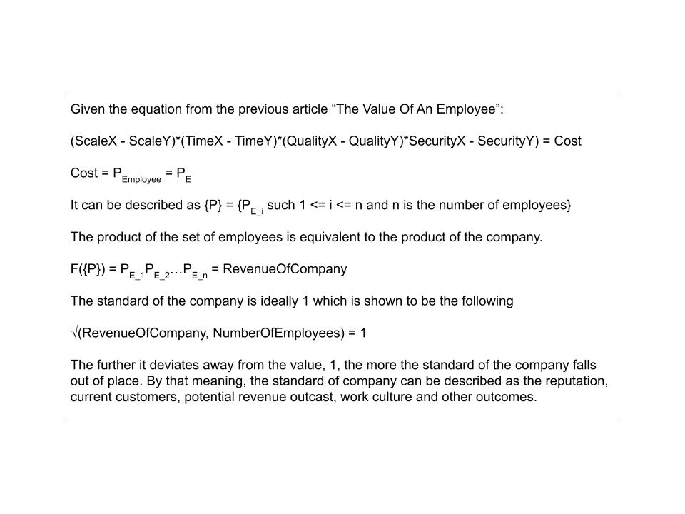
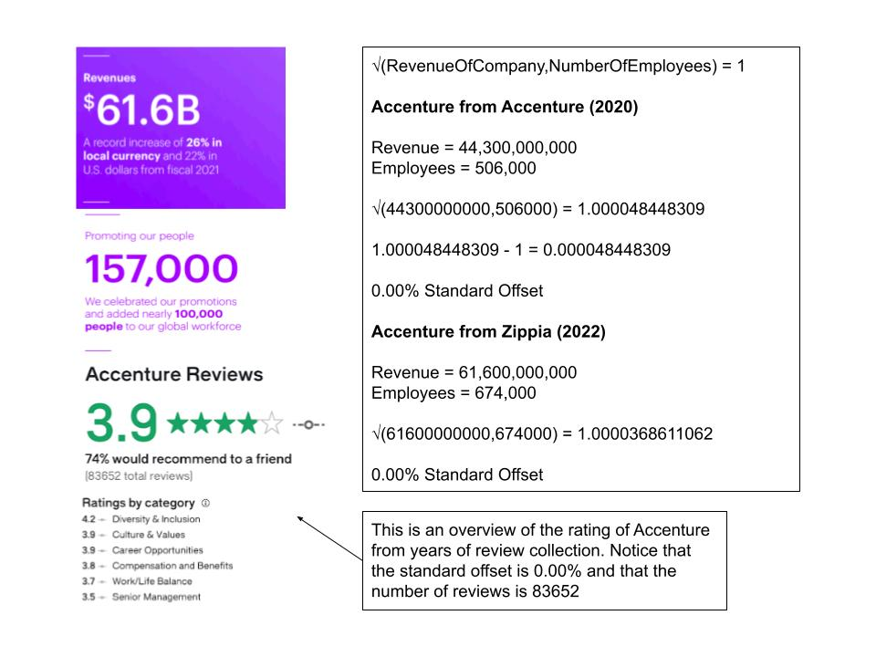
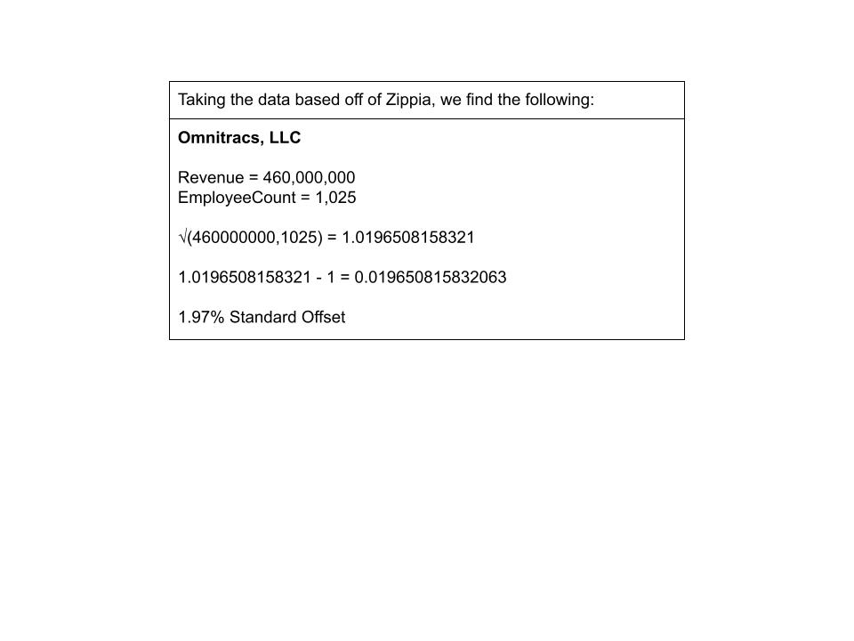
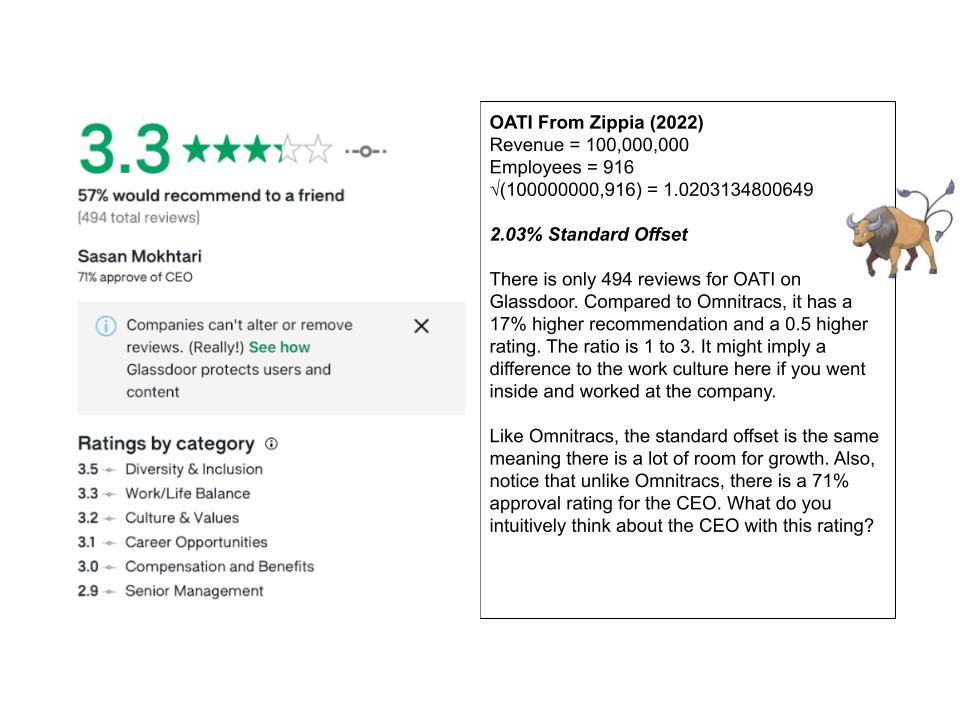
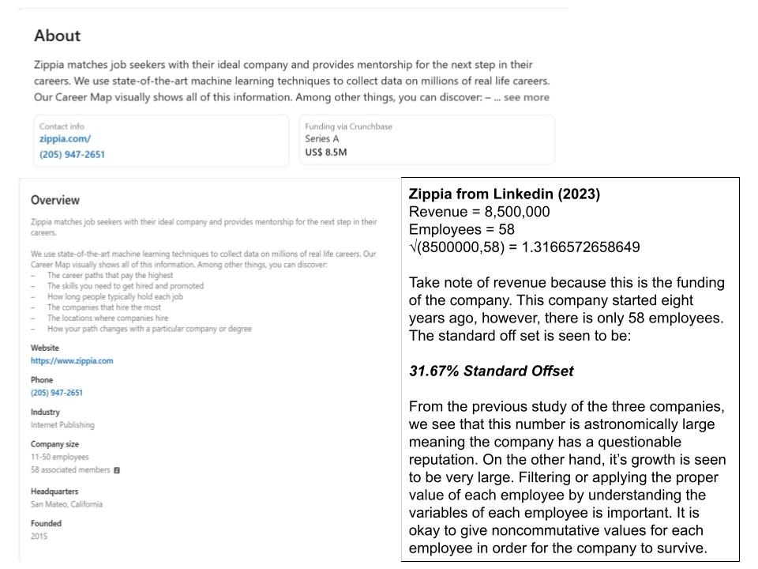
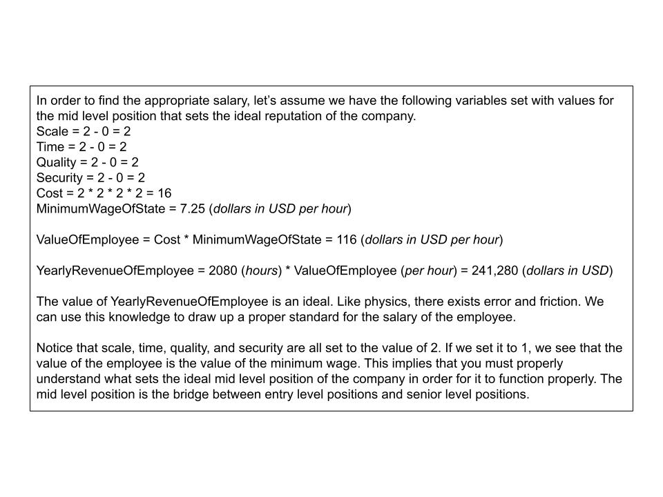
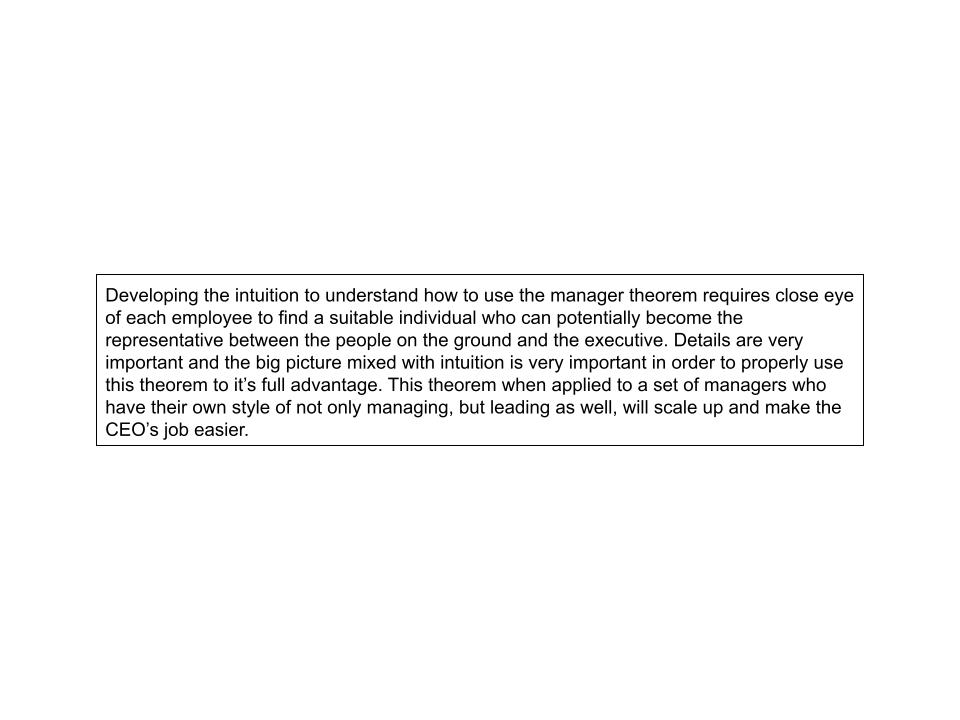

# Manager Theory

### 1. The Product Of A Company

### 2. Calculation Of Accenture

### 3. Calculation Of Omnitracs

### 4. Calculation Of OATI

### 5. Zippia The Startup

### 6. The Ideal Salary

### 7. Conclusion

-----

# References

Ung, E. (2023). The Value Of An Employee. https://github.com/ericung/TheValueOfAnEmployee/tree/main

[Accenture Fiscal 2022 Annual Report](Resources/Accenture-Fiscal-2022-Annual-Report). (2023)

Accenture revenue: annual, quarterly, and historic - Zippia. (2023, July 21). https://www.zippia.com/accenture-careers-13401/revenue/

OATI revenue: annual, quarterly, and historic - Zippia. (2023, July 21). https://www.zippia.com/oati-careers-1550765/revenue/

OmniTracs revenue: annual, quarterly, and historic - Zippia. (2023, July 21). https://www.zippia.com/omnitracs-careers-33686/revenue/

Zippia. (n.d.). Zippia | LinkedIn. https://www.linkedin.com/company/zippia/

