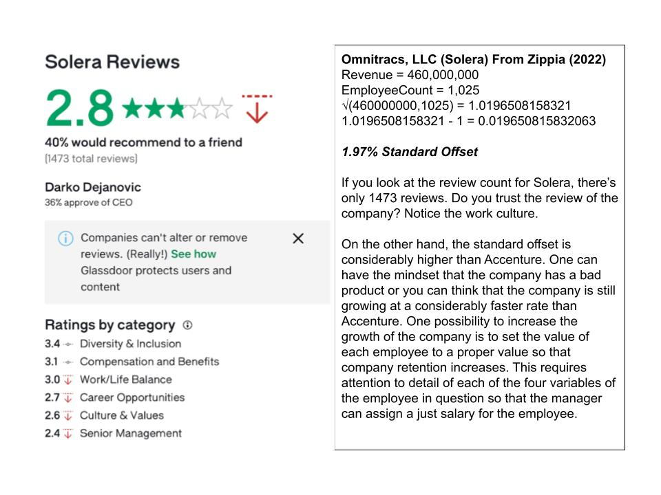

# Manager Theory

### 1. 

### 2.

### 3.

### 4.

### 5.

### 6.

-----

### References

[Accenture Fiscal 2022 Annual Report](Resources/Accenture-Fiscal-2022-Annual-Report). (2023)

Accenture revenue: annual, quarterly, and historic - Zippia. (2023, July 21). https://www.zippia.com/accenture-careers-13401/revenue/

OATI revenue: annual, quarterly, and historic - Zippia. (2023, July 21). https://www.zippia.com/oati-careers-1550765/revenue/

OmniTracs revenue: annual, quarterly, and historic - Zippia. (2023, July 21). https://www.zippia.com/omnitracs-careers-33686/revenue/

Zippia. (n.d.). Zippia | LinkedIn. https://www.linkedin.com/company/zippia/

